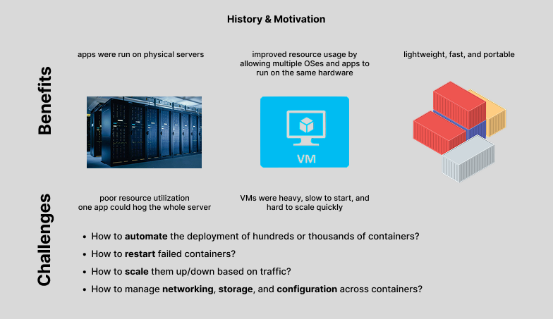
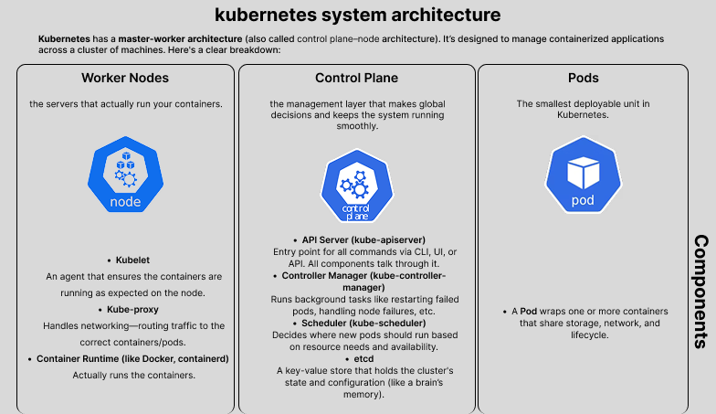

# Inception-of-Things ( IoT )
## 🚀 Minimal Kubernetes Introduction with K3d, K3s & Vagrant

This project is a **minimal introduction to Kubernetes**, designed to deepen your understanding of container orchestration using lightweight tools like **K3d**, **K3s**, and **Vagrant**.

## 📚 Overview

You will:

- 🖥️ Set up a personal virtual machine using **Vagrant** and the Linux distribution of your choice.
- ☸️ Install and work with **K3s**, a lightweight Kubernetes distribution.
- 🌐 Learn how to configure and use **Ingress** in K3s.
- 🧰 Discover **K3d**, a tool that runs K3s in Docker containers and simplifies local Kubernetes development.

> ⚠️ Kubernetes is a powerful and complex tool. This project offers a basic introduction and is not intended to make you an expert.

## 🧰 Tools

- [K3d](https://k3d.io/)
- [K3s](https://k3s.io/)
- [Vagrant](https://www.vagrantup.com/)

## ✅ Objectives

- Gain hands-on experience with Kubernetes in a local environment.
- Understand the use of K3s and K3d for lightweight clusters.
- Practice setting up and using Ingress controllers.

## 🧠 Background & Motivation

*Image: History and motivation behind Kubernetes*

## 🏗️ System Architecture

*Image: High-level architecture of a Kubernetes system*

---

Feel free to customize this project and use it as a base for deeper Kubernetes exploration.